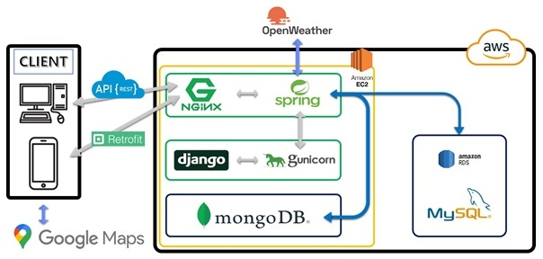

# Project Talaria

## 날씨API를 활용한 여행 계획 생성 및 머신러닝 기반 유저 추천 서비스
#### Team Name
- 트래비앙 (비트 교육센터)
#### Team Members
- [Leejs-1014](https://github.com/Leejs-1014) : AI 개발, 백엔드 개발, 프론트엔드 개발, 데이터베이스 구축
- [idgod8451](https://github.com/idgod8451) : 백엔드 개발, 프론트엔드 개발, 서버 구축
- [NoelWON](https://github.com/NoelWON) : 백엔드 개발, 프론트엔드 개발, 데이터베이스 구축
- [jiman28](https://github.com/jiman28) : 백엔드 개발, 안드로이드 개발
#### Demonstration Video
- https://drive.google.com/file/d/15BRrBIHSfSPXBAsYwlD1Qxs_opiFTvps/view?usp=sharing
#### Awards
- '2023년 벤처·스타트업 아카데미 통합 프로젝트 발표회' 최우수상 수상

  
## Project Introduction
현재 여행 수요의 지속적인 증가에 대응하여 개인의 취향과 여행 목적에 부합하는 맞춤형 여행 계획 작성 서비스를 목표로 하고 있습니다. Google API와 날씨 API를 활용하여 사용자에게 정확하고 편리한 여행 정보를 제공하며, 머신러닝 기반의 군집화 알고리즘을 활용하여 사용자의 여행 성향과 유사한 그룹을 형성하여 사용자를 추천해줍니다.
사용자가 여행을 계획하는 과정에서 날씨 정보를 포함시켜 구체적인 계획수립을 도와주고 사용자가 선택한 관광지들을 토대로 여행 성향을 분석하여 성향이 비슷한 유저의 플랜을 확인 할 수 있습니다.
  
  
## Development
- 개발 기간 : 23.09.11 ~ 23.12.08
- 개발 환경 : Ubuntu, Window10, Window11
- 개발 언어 : Java, Python, Kotlin, JavaScript, HTML5, CSS
- 데이터베이스 : MySQL, MongoDB
- 프레임워크 : Spring, Django, Android
- 개발 도구 : Eclipse, VS Code, GitHub, Android Studio, AWS
- 라이브러리 및 플랫폼 : Google Maps Platform, OpenWeatherMap, SummerNote, Jquery, AJAX, BootStrap, NGINX, Gunicorn, Docker, Jetpack Compose, Retrofit, Stomp, Web Socket, Identity Platform (Google)

  
## Design focus
- 날씨를 기반으로 유저가 정한 날짜에 적절한 관광지를 배분하도록 설계
- 관광지의 배분이 도시를 기반으로 이루어질 수 있도록 설계
- 유저가 고른 관광지 데이터를 기반으로 유저의 선호도 및 성향을 조사, 유저 개인화면에 다이어그램 형태로 배분
- 웹과 모바일 동시 서비스를 통한 사용자 편의성 도모

  
## System Architecture

  
## Settings
- All API KEYs and other passwords were deleted. You must use your own Keys, ID and Password

###### Please follow the instructions below

#### Spring: STS4 (application.properties)
- need MongoDB installed, DB name 'test'
- need MySQL ID & Password
- need to create MySQL DB named 'project'
- need OAuth 2.0 client ID & secret (Google Social Login)
- need [Google Map Api Key](https://mapsplatform.google.com/)
- need [OpenWeatherMap Api Key](https://openweathermap.org/api) -> WeatherByGPSApplication.java

#### Django: VS code
- need [Google Map Api Key](https://mapsplatform.google.com/)

#### Android: Android Studio (local.properties (SDK Location))
1. start Android Studio
2. Go to your Project(Android) and Create a file with the following name: local.properties
3. Open the file(local.properties) and write the followings below:
   sdk.dir=C\:\\Users\\your_UserName_directory\\AppData\\Local\\Android\\Sdk
   GOOGLE_MAPS_API_KEY=Your_Google_Maps_Api_Key_Here
   BASE_URL=http://Your_IP_Address:8080/m/
   BASE_BOARD_SUMMERNOTE=http://Your_IP_Address:8080/

  
## References
- 참고 자료
  + [Google Maps Platform](https://mapsplatform.google.com/)
  + [Google Codelabs](https://codelabs.developers.google.com/)
  + [android-maps-compose](https://googlemaps.github.io/android-maps-compose/index.html)
  + [Material Design](https://m3.material.io/)
  + [Android 개발자를 위한 Jetpack Compose](https://developer.android.com/courses/jetpack-compose/course?hl=ko)
  + [Places SDK for Android](https://developers.google.com/maps/documentation/places/android-sdk/overview?hl=ko)
  + [Geocoding API](https://developers.google.com/maps/documentation/geocoding/overview?hl=ko)
  + [Directions API](https://developers.google.com/maps/documentation/directions/overview?hl=ko)
  + [OpenWeatherMap API](https://openweathermap.org/)
  + [점프 투 스프링부트 (위키독스)](https://wikidocs.net/book/7601)
  + [JDK 17 Documentation](https://docs.oracle.com/en/java/javase/17/docs/api/index.html)
- 참고 서적
  + 안드레아스 뮐러, 세라 가이도 「파이썬 라이브러리를 활용한 머신러닝」 한빛 미디어
